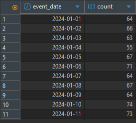
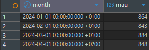
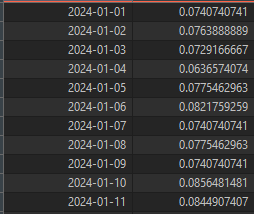
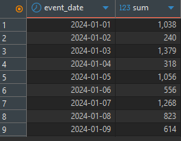
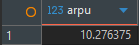

using: DBeaver
Tables:

    users (
        id INT,
        country TEXT,
        plan TEXT,
        signup_date DATE
    );

    events (
        event_id INT,
        user_id INT,
        event_type TEXT,
        event_date DATE,
        revenue INT
    );

1. DAU (Daily Active Users)

DAU (Daily Active Users) measures the number of unique users who are active on a given day.

In this project, a user is considered active if they perform any action, such as login, view, or purchase.

DAU helps determine whether the application is “alive,” but without additional context (e.g., total user base), it does not provide much insight on its own.

  

2. MAU (Monthly Active Users)

MAU (Monthly Active Users) measures the number of unique users active within a month.

Similar to DAU, MAU alone does not reveal much. However, when combined with DAU, it becomes much more meaningful and allows deeper analysis of user behavior.

  

3. Stickiness

Stickiness indicates how frequently users return to the application.

It is calculated as the ratio of DAU to MAU:

DAU/MAU

This metric helps evaluate how engaging the application is.

  

In this example, stickiness ranges between 7–8%, which suggests that:

users are not returning frequently,

the application has low engagement,

further analysis is needed to identify potential issues (e.g., UX, value proposition, competition).

4. Revenue per Day

shows how much money the application generates each day.

It can be used to:

monitor overall financial performance,

identify trends (growth or decline),

detect periods of strong or weak revenue.

  

5. ARPU (Average Revenue per User)

measures how much revenue is generated per user on average.

It is calculated as:

Total Revenue/Number of Users

ARPU can be useful for:

evaluating monetization effectiveness,

comparing performance across segments (e.g., countries, plans),

estimating how many users are needed to reach profitability.

However, ARPU can be misleading in some cases.

For example:

if there are 10 users,

and only 1 user spends 100 while the others spend 0,

then ARPU = 10.

This may suggest decent performance, even though most users are not paying.

  

In this example, ARPU is around 10 per user, which can be used for further analysis, such as:

estimating how many users are required to achieve profitability,

understanding overall monetization efficiency.

